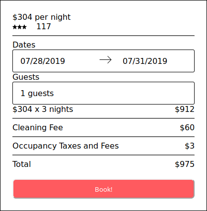
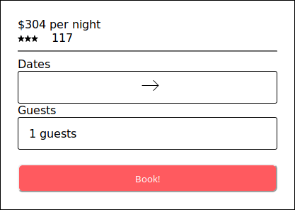
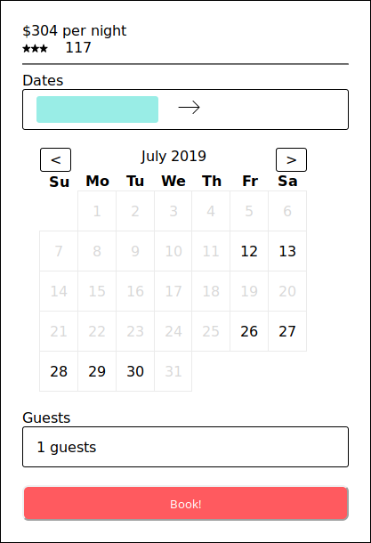

# Booking Module

> Module which allows user to view open dates for a property, input and start a booking. 




  
## Table of Contents

1. [Related Projects](#related projects)
1. [Usage](#Usage)
1. [Requirements](#requirements)
1. [Development](#development)
1. [Screenshots](#screenshots)

## Related Projects

  - https://github.com/lodge-io/image-gallery-module 
  - https://github.com/lodge-io/reviews-module
  - https://github.com/lodge-io/description-module

## Usage

> Some usage instructions

## Requirements

An `nvmrc` file is included if using [nvm](https://github.com/creationix/nvm).

- Node 8.15.1

## Development

### Installing Dependencies

From within the root directory:

```sh
npm install -g webpack
npm install
```
## Screenshots

---

---

